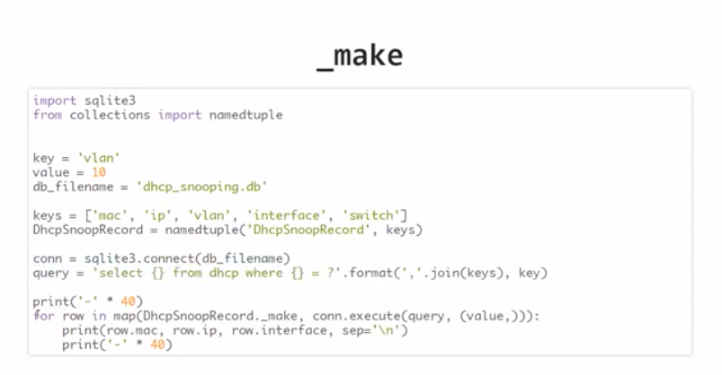

## IntersectionsPromo

IntersectionsPromo - скрипт, который помогает найти пересечения временных периодов

## Запуск

- Скачайте код
- Создайте виртуальное окружение
- Установите библеотеки, необходимые для работы, перечисленные в `requirements.txt`, используя 

    `pip install -r requirements.txt`

- Запишите исходные данные по периодам в файл `input_data.py`, в переменные формате
```
    promotion_periods_first_part = [
    ('6/7/2020', '8/7/2020'),
    ('10/7/2020', '15/7/2020'),
    ('19/9/2020', '23/9/2020')
]

    promotion_periods_second_part = [
    ('7/7/2020', '12/7/2020'),
    ('19/9/2020', '22/9/2020')
]

```

- Запустите скрипт командой `python main.py`
- Решение так же реализовано с использованием `namedtuple` в файле `namedtuple.py`. Данный вариант может быть более удобен и читаем. Использования метода класса `_make` позволит создавать объекты сразу при выгрузке данных из базы.




## Цели проекта

Код написан в учебных целях.
